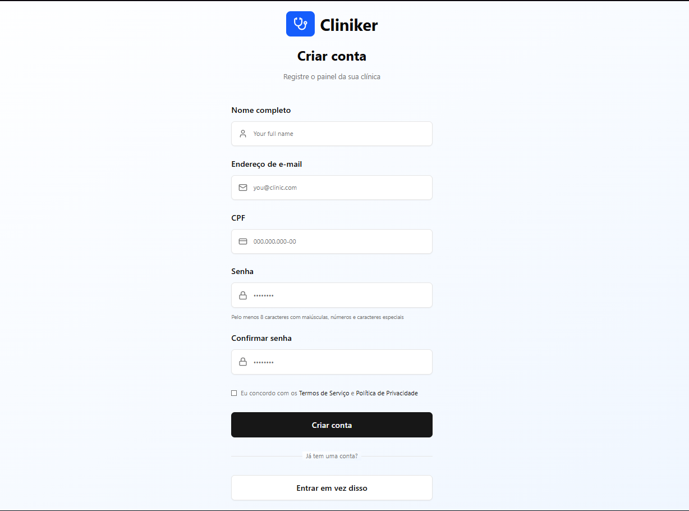
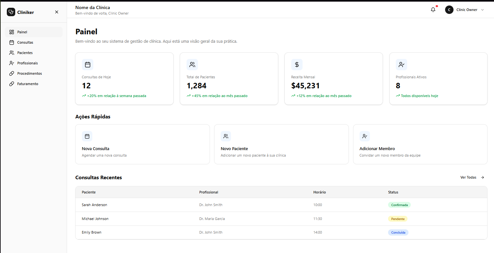
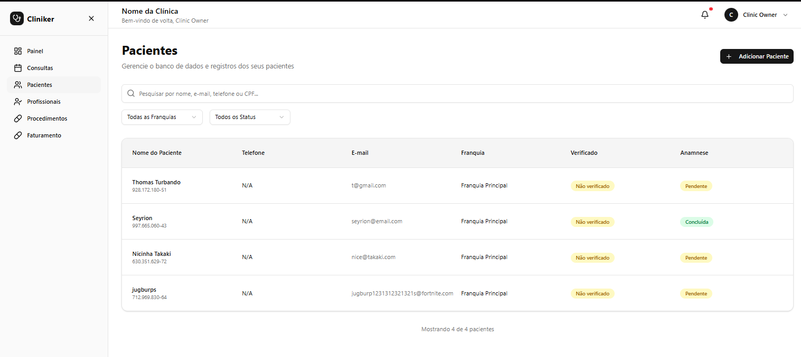
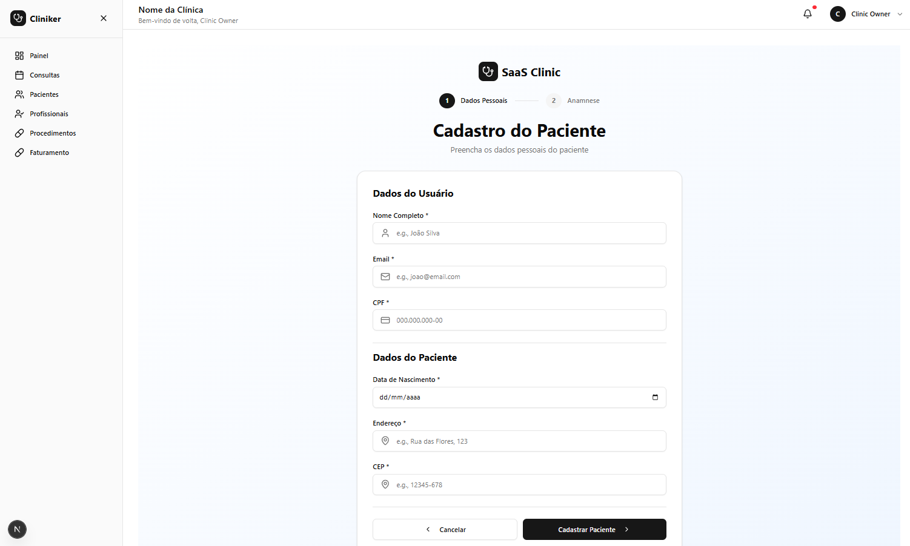
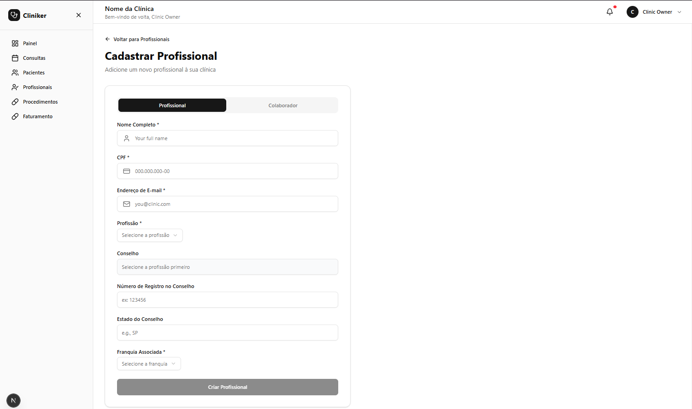
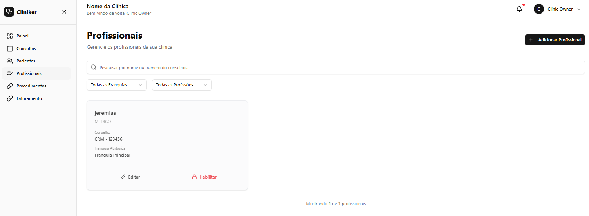
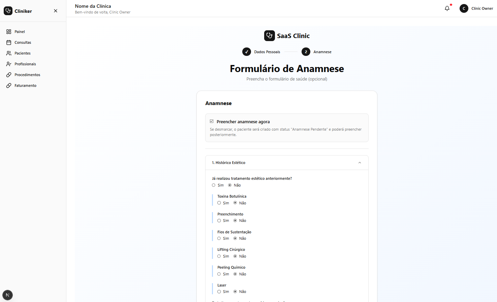
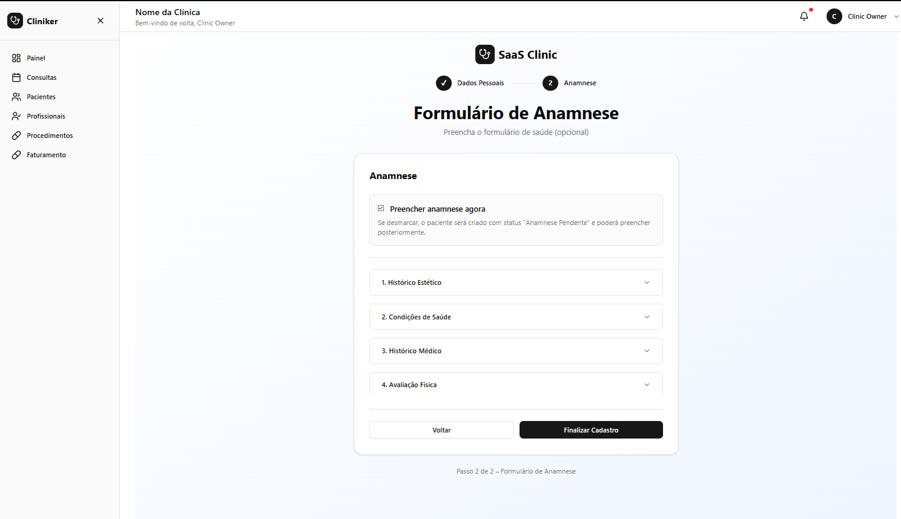
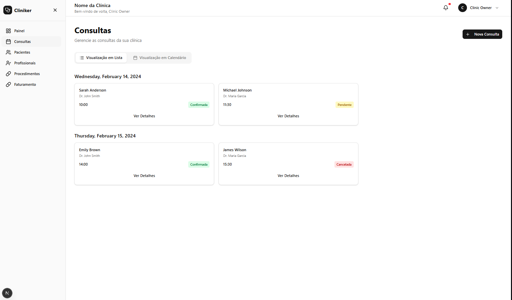

# SaaS Clinic – Frontend

Frontend da plataforma **SaaS multi-tenant** para gestão de clínicas, desenvolvido com Next.js 16 App Router e arquitetura orientada a componentes reutilizáveis. Sistema projetado para escalabilidade horizontal, isolamento de tenants e experiência de usuário consistente.

Interface responsiva que consome a API REST do backend NestJS, implementando autenticação baseada em cookies httpOnly, refresh token automático, multi-tenancy por slug na URL e gerenciamento de estado global via Context API.

## 📸 Preview

### Autenticação
<div align="center">
  
  <p><em>Tela de criação de conta</em></p>
</div>

### Dashboard
<div align="center">
  
  <p><em>Painel administrativo principal</em></p>
</div>

### Gestão de Pacientes
<div align="center">
  
  <p><em>Listagem e gestão de pacientes</em></p>
</div>

<div align="center">
  
  <p><em>Formulário de cadastro de paciente</em></p>
</div>

### Gestão de Profissionais
<div align="center">
  
  <p><em>Listagem de profissionais</em></p>
</div>

<div align="center">
  
  <p><em>Formulário de cadastro de profissional</em></p>
</div>

### Anamnese
<div align="center">
  
  <p><em>Formulário de anamnese - Histórico estético e condições de saúde</em></p>
</div>

<div align="center">
  
  <p><em>Formulário de anamnese - Histórico médico e avaliação física</em></p>
</div>

### Agendamentos
<div align="center">
  
  <p><em>Gestão de agendamentos</em></p>
</div>

---

## Principais Responsabilidades

- **Autenticação e autorização**: Login, registro, gerenciamento de sessão com refresh token automático
- **Multi-tenancy**: Isolamento de tenants via slug na URL (`/tenant-slug/dashboard`)
- **Gestão de clínicas e franquias**: Criação e configuração de clínicas e unidades
- **Dashboard administrativo**: Painel com métricas, agendamentos, pacientes e profissionais
- **Cadastros**: Pacientes, profissionais, procedimentos e serviços
- **Validação client-side**: CPF, CNPJ com máscaras e validação em tempo real

---

## Arquitetura

### Estrutura de Diretórios

```
src/
├── app/                    # Next.js App Router
│   ├── [tenant]/          # Rotas dinâmicas com tenant
│   │   ├── auth/          # Autenticação
│   │   ├── dashboard/     # Área administrativa
│   │   └── clinic/        # Gestão de clínicas
│   └── (public)/          # Rotas públicas (route groups)
├── components/            # Componentes UI reutilizáveis (shadcn/ui)
├── context/              # Context API (AuthContext)
├── hooks/                # Custom hooks (useTenant)
├── lib/                  # Utilitários e configurações
│   ├── api.ts            # Cliente Axios com interceptors
│   ├── tenant.ts         # Lógica de multi-tenancy
│   └── tenant-navigation.ts
├── services/             # Camada de serviços (API calls)
│   ├── auth/
│   ├── clinic/
│   └── franchise/
└── utils/                # Validações e helpers
```

### Separação de Responsabilidades

- **App Router**: Roteamento, layouts server-side, proteção de rotas
- **Services Layer**: Abstração de chamadas HTTP, DTOs tipados
- **Context API**: Estado global de autenticação, sincronização com cookies
- **Components**: UI components isolados e reutilizáveis
- **Hooks**: Lógica compartilhada (tenant, navegação)

---

## Decisões Técnicas Importantes

### Multi-Tenancy por Slug na URL

Implementação de multi-tenancy via **dynamic route segments** (`[tenant]`) do Next.js App Router. O tenant é extraído do primeiro segmento da URL (`/clinicatakaki/dashboard`), validado no middleware e propagado via hooks customizados (`useTenant`). Permite isolamento visual e lógico sem necessidade de subdomínios.

**Benefícios**: SEO-friendly, compartilhamento de links diretos, cache por tenant no CDN, simplicidade de deploy.

### Autenticação Baseada em Cookies HttpOnly

Autenticação via cookies `httpOnly` gerenciados pelo backend, eliminando exposição de tokens no JavaScript. O cliente Axios envia cookies automaticamente via `withCredentials: true`, e o interceptor trata refresh token transparente em caso de 401.

**Fluxo**: Login → Backend seta `access_token` e `refresh_token` → Interceptor detecta 401 → Chama `/refresh` → Reexecuta request original.

### Server-Side Route Protection

Proteção de rotas no **layout server component** via `cookies()` do Next.js, validando `access_token` antes do render. Redirecionamento server-side mantém o tenant na URL, evitando flash de conteúdo não autorizado.

### Context API para Estado Global

`AuthContext` centraliza estado de autenticação, sincronizando com cookies via `fetchMe()` no mount. Evita prop drilling e mantém consistência entre componentes. Lazy loading: não busca usuário em rotas públicas (`/auth/*`).

### Service Layer com DTOs Tipados

Camada de serviços isolada com DTOs TypeScript para type-safety end-to-end. Cada domínio (auth, clinic, franchise) possui seu service e DTOs, facilitando manutenção e evolução da API.

---

## Segurança Implementada

- **Cookies HttpOnly**: Tokens nunca expostos ao JavaScript
- **Refresh Token Automático**: Interceptor Axios renova tokens expirados transparentemente
- **Server-Side Validation**: Verificação de autenticação no layout antes do render
- **Middleware de Proteção**: Validação de tenant e redirecionamento de rotas protegidas
- **Validação Client-Side**: CPF/CNPJ com algoritmos de validação e máscaras
- **CORS com Credentials**: Configuração `withCredentials` para envio de cookies cross-origin

---

## Padrões Utilizados

### Component-Based Architecture

Componentes funcionais com hooks, isolamento de responsabilidades, composição sobre herança. UI components baseados em **shadcn/ui** (Radix UI primitives) para acessibilidade e customização.

### Custom Hooks Pattern

Lógica reutilizável extraída para hooks (`useTenant`, `useAuthContext`), facilitando testes e manutenção. Hooks encapsulam side effects e estado local.

### Service Layer Pattern

Abstração de chamadas HTTP em services tipados, desacoplando componentes da API. Facilita mock em testes e mudanças de implementação.

### Route Groups

Uso de route groups `(panel)` e `(public)` para organização sem afetar URLs, permitindo layouts diferentes por contexto.

### Dynamic Routes

Rotas dinâmicas `[tenant]` para multi-tenancy, com validação no middleware e type-safety via params.

---

## Diferenciais Técnicos

- **Next.js 16 App Router**: Server Components, Streaming SSR, otimizações automáticas
- **React 19**: React Compiler habilitado para otimizações automáticas
- **TypeScript Strict Mode**: Type-safety end-to-end, inferência de tipos
- **Biome**: Linter e formatter rápido (substitui ESLint + Prettier)
- **Tailwind CSS 4**: Utility-first CSS com variáveis CSS para theming
- **Axios Interceptors**: Refresh token automático, tratamento centralizado de erros
- **Validação em Tempo Real**: CPF/CNPJ com feedback visual (borda verde/vermelha)
- **Toast Notifications**: Feedback não intrusivo via Sonner
- **Responsive Design**: Mobile-first, breakpoints consistentes

---

## Tecnologias Utilizadas

**Core:**
- Next.js 16.1.6 (App Router)
- React 19.2.3
- TypeScript 5
- Node.js 20+

**HTTP Client:**
- Axios 1.13.5

**UI:**
- Tailwind CSS 4
- Radix UI (primitives acessíveis)
- shadcn/ui
- Lucide React (ícones)
- Sonner (toast notifications)

**Validação:**
- Algoritmos customizados (CPF, CNPJ)

**Developer Experience:**
- Biome 2.2.0 (linting, formatting)
- React Compiler (otimizações automáticas)
- pnpm (package manager)

---

## Possíveis Evoluções Arquiteturais

### Estado Global
- Migração para **Zustand** ou **Jotai** para estado mais granular e performático
- Implementar **React Query** para cache de requisições e sincronização server-state

### Performance
- **Server Components** para páginas estáticas (listagens, relatórios)
- **Streaming SSR** para carregamento progressivo
- **Image Optimization** do Next.js para assets
- **Code Splitting** por rota automático

### Testes
- **Vitest** para testes unitários de hooks e utils
- **Playwright** para testes E2E críticos
- **Testing Library** para testes de componentes

### Internacionalização
- **next-intl** para i18n multi-idioma
- Suporte a RTL (Right-to-Left)

### Observabilidade
- Integração com **Sentry** para error tracking
- **Vercel Analytics** para métricas de performance
- Logging estruturado no cliente

### PWA
- Service Workers para offline-first
- Install prompt
- Push notifications

---

## Status do Projeto

**Em desenvolvimento ativo** – Funcionalidades core implementadas, evolução contínua com foco em produção.

---

## Backend

Frontend consome a API do backend NestJS: [saas-clinic](https://github.com/OtavioCollere/saas-clinic)
